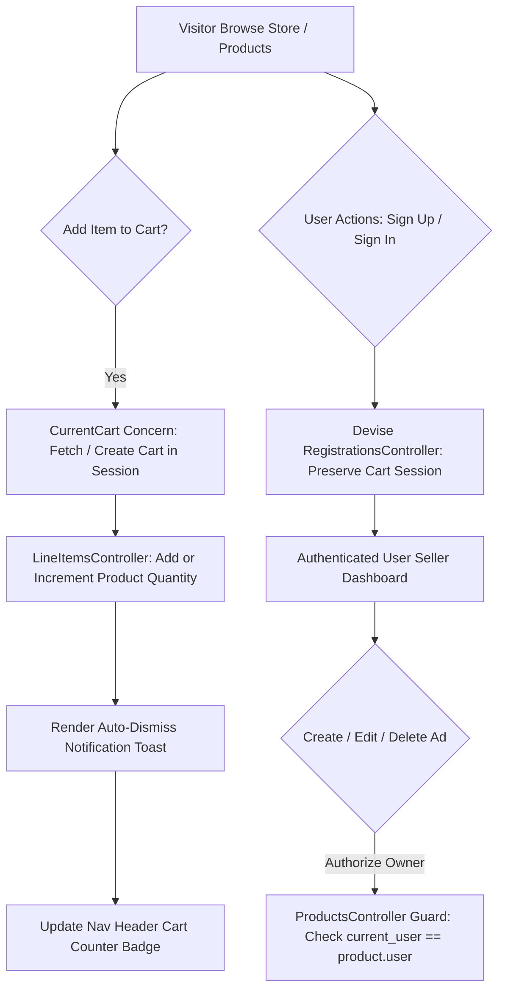

# Shop 🛒

[](https://www.ruby-lang.org/)
[](https://rubyonrails.org/)
[](https://www.sqlite.org/)
[](https://bulma.io/)

Shop is a full-stack e-Commerce marketplace web application built with Ruby on Rails and Bulma CSS. It allows users to register accounts, post item listings with image uploads, manage personal product ads, and shop using an interactive session-persistent shopping cart.

---

## ⚡ Key Features

- **User Authentication**: User registration and account management powered by Devise with custom name attributes and credential validation.
- **Product Ad Creator**: Authenticated users can list products specifying title, brand, model, condition, finish, price, description, and image uploads via CarrierWave.
- **Seller Attribution**: Product cards in the marketplace display seller names ("Sold by: [Seller]") directly on homepage product cards without requiring buyers to open each ad.
- **Ownership Authorization**: Strict server-side authorization guards and client-side controls ensure that only the user who created an ad can edit or delete it.
- **Direct Add-to-Cart**: Quick "Add to Cart" action buttons directly on homepage product grid cards and product detail pages.
- **Session Cart Persistence**: Guest shopping carts persist via session storage and carry over active items when a guest signs in.
- **Granular Cart Management**: Adjust item quantities (`+` / `-`), remove individual line items, calculate real-time order totals, and trigger auto-dismissing toast notifications (`"Added to your cart"`, `"Removed from your cart"`).
- **Empty Cart Safeguard**: Interactive confirmation modal ("Are you sure?") before clearing cart contents and redirecting to the storefront.
- **Checkout Flow**: Simulated credit card checkout modal on the cart page for order completion.

---

## 🏗 Data & Request Flow



---

## ⚙️ How to Run Locally

### Prerequisites
- **Ruby**: version 2.6.0+ or 3.0.0+ (installed via Homebrew or system)
- **ImageMagick**: required for CarrierWave image resizing (`brew install imagemagick`)
- **SQLite3**: database installed on host system

### Setup & Execution Steps

1. **Clone & Navigate to Project**:
   ```bash
   git clone <repository-url>
   cd shop
   ```

2. **Configure Environment PATH (macOS / Homebrew)**:
   ```bash
   export PATH="/opt/homebrew/bin:/opt/homebrew/opt/ruby/bin:$PATH"
   ```

3. **Install Dependencies**:
   ```bash
   USE_FREEDESKTOP_PLACEHOLDER=true NOKOGIRI_USE_SYSTEM_LIBRARIES=1 bundle install
   ```

4. **Database Setup & Seeding**:
   ```bash
   DISABLE_SPRING=1 bundle exec rails db:migrate
   DISABLE_SPRING=1 bundle exec rails db:seed
   ```

5. **Launch Development Server**:
   ```bash
   DISABLE_SPRING=1 bundle exec rails s
   ```

6. **Access Application**:
   Open your browser and navigate to `http://localhost:3000`.


---

## 📂 Project Structure

```
shop/
├── app/
│   ├── controllers/
│   │   ├── concerns/
│   │   │   └── current_cart.rb         # Session cart persistence helper
│   │   ├── carts_controller.rb         # Cart views & clear action
│   │   ├── line_items_controller.rb    # Add, remove, and quantity controls
│   │   ├── products_controller.rb      # Product CRUD & authorization guards
│   │   ├── registrations_controller.rb # Custom Devise registration parameters
│   │   └── store_controller.rb         # Store index handler
│   ├── helpers/
│   │   └── products_helper.rb          # Seller attribution & owner checks
│   ├── models/
│   │   ├── cart.rb                     # Cart totals & line items association
│   │   ├── line_item.rb                # Product line item subtotals
│   │   ├── product.rb                  # Product validations & image uploader
│   │   └── user.rb                     # User authentication model
│   ├── uploaders/
│   │   └── image_uploader.rb           # CarrierWave image uploader
│   └── views/
│       ├── carts/                      # Shopping cart page & checkout modal
│       ├── devise/                     # Authentication & registration forms
│       ├── layouts/                    # Application wrapper with cart badge & toasts
│       └── products/                   # Storefront grid, detail views, and ad form
├── config/
│   └── routes.rb                       # Application routes & resource mappings
├── db/
│   ├── migrate/                        # Database migrations (users, products, carts, line_items)
│   └── seeds.rb                        # Initial database seed records
└── vendor/
    └── bundle/                         # Pre-packaged gem dependencies
```

---

## 📝 License
Distributed under the MIT License. See `LICENSE.md` for details.
