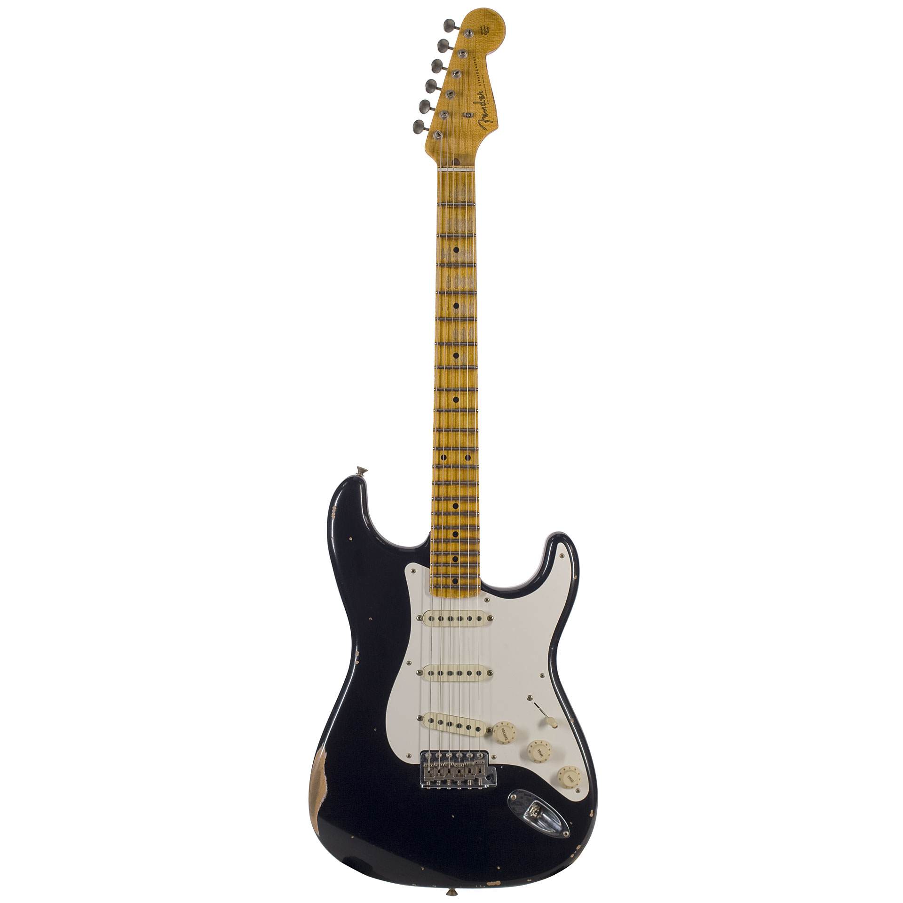

# 🛒 MarketPulse

[](https://www.ruby-lang.org/)
[](https://rubyonrails.org/)
[](https://www.sqlite.org/)
[](https://bulma.io/)
[](LICENSE.md)

**MarketPulse** is a full-stack e-Commerce marketplace web application built with Ruby on Rails and Bulma CSS. It enables users to create accounts, list product advertisements with CarrierWave image uploads, manage personal product inventories, track seller attributions, and shop using session-persistent shopping carts.

---

## ⚡ Key Highlights

- **Authentication & User Accounts**: User registration, authentication, and profile settings powered by Devise with custom parameter sanitization.
- **Product Ad Creator & Inventory**: Authenticated sellers can create, edit, and delete product listings with brand, model, condition, finish, price, and CarrierWave image uploads.
- **Seller Attribution Guards**: Marketplace product grid cards display seller names ("Sold by: [Seller]") directly on storefront product cards with strict server-side ownership authorization guards.
- **Session-Persistent Cart Concern**: Guest shopping carts persist via session storage and seamlessly transfer active line items when a guest logs in.
- **Granular Cart & Checkout Flow**: Adjust line item quantities (`+` / `-`), remove items, compute real-time order totals, trigger auto-dismissing toast notifications, and simulate checkout modal completion.

---

## 📋 Table of Contents

- [Key Highlights](#-key-highlights)
- [System Architecture](#-system-architecture)
- [Cart Session & Checkout Sequence](#-cart-session--checkout-sequence)
- [Setup & Execution](#-setup--execution)
- [Project Directory Structure](#-project-directory-structure)
- [License](#-license)

---

## 🖼️ Marketplace Product Catalog

| Fender Guitar | Ferrari Model | Fossil Watch | Opel Vintage |
| :---: | :---: | :---: | :---: |
|  |  |  |  |

---

## 🏗️ System Architecture

```mermaid
graph TD
    A[Storefront Visitor / User] --> B[Rails Routing & Dispatcher]
    
    B --> C{Action Type?}
    C -- Browse / Cart --> D[StoreController & CartsController]
    C -- Auth / Account --> E[Devise RegistrationsController]
    C -- Manage Ads --> F[ProductsController]
    
    D --> G[CurrentCart Concern: Session Storage Manager]
    G --> H[LineItemsController: Add / Increment / Remove Items]
    
    F -->|Authorization Check| I{current_user == product.user?}
    I -- Yes --> J[Execute Product CRUD]
    I -- No --> K[Redirect & Render Access Denied Flash]
    
    H --> L[(SQLite Database)]
    J --> L
```,StartLine:33,TargetContent:

---

## 📐 Cart Session & Checkout Sequence

```mermaid
sequenceDiagram
    participant Visitor
    participant Store as Store Front UI
    participant Cart as CurrentCart Concern
    participant DB as SQLite Database
    participant Auth as Devise Auth

    Visitor->>Store: Click "Add to Cart" on Product Card
    Store->>Cart: Retrieve Session cart_id or Create New Cart
    Cart->>DB: Find / Create LineItem (Product ID, Quantity)
    DB-->>Store: Updated LineItems & Total Price
    Store-->>Visitor: Render Toast Notification ("Added to your cart") & Update Header Counter
    
    Visitor->>Auth: Sign In / Register
    Auth->>Cart: Transfer Active Session Cart to Authenticated User
    Visitor->>Store: Open Cart Page & Click "Simulate Checkout"
    Store-->>Visitor: Render Checkout Modal & Order Confirmation Summary
```

---

## 🚀 Setup & Execution

### Prerequisites

- **Ruby**: Version 2.7+ or 3.0+ installed.
- **ImageMagick**: Required for CarrierWave image resizing (`brew install imagemagick`).
- **SQLite3**: Relational database installed.

---

### Setup & Run

1. **Clone Repository**:
   ```bash
   git clone https://github.com/sahmedhusain/marketpulse.git
   cd marketpulse
   ```

2. **Configure Environment PATH (macOS / Homebrew)**:
   ```bash
   export PATH="/opt/homebrew/bin:/opt/homebrew/opt/ruby/bin:$PATH"
   ```

3. **Install Gem Dependencies**:
   ```bash
   USE_FREEDESKTOP_PLACEHOLDER=true NOKOGIRI_USE_SYSTEM_LIBRARIES=1 bundle install
   ```

4. **Database Migrations & Seed Data**:
   ```bash
   DISABLE_SPRING=1 bundle exec rails db:migrate
   DISABLE_SPRING=1 bundle exec rails db:seed
   ```

5. **Start Rails Server**:
   ```bash
   DISABLE_SPRING=1 bundle exec rails s
   ```
   *MarketPulse will start at `http://localhost:3000`.*

---

## 📂 Project Directory Structure

```
marketpulse/
├── app/
│   ├── controllers/
│   │   ├── concerns/current_cart.rb    # Session cart persistence module
│   │   ├── carts_controller.rb        # Cart views & clear actions
│   │   ├── line_items_controller.rb   # Line item quantity controls
│   │   ├── products_controller.rb     # Product CRUD & owner authorization
│   │   └── store_controller.rb        # Marketplace storefront controller
│   ├── helpers/
│   │   └── products_helper.rb         # Seller attribution & ownership checks
│   ├── models/
│   │   ├── cart.rb                    # Cart total calculations & line items association
│   │   ├── line_item.rb               # Line item subtotals
│   │   ├── product.rb                 # Product validations & image uploader
│   │   └── user.rb                    # Devise user authentication model
│   ├── uploaders/
│   │   └── image_uploader.rb          # CarrierWave image processor
│   └── views/                         # Bulma storefront, cart, & modal views
├── config/                            # Rails configuration & routing maps
├── db/                                # Migrations and seed file
└── README.md                          # Documentation
```

---

## 📄 License

Distributed under the MIT License. See [LICENSE](LICENSE.md) for details.
